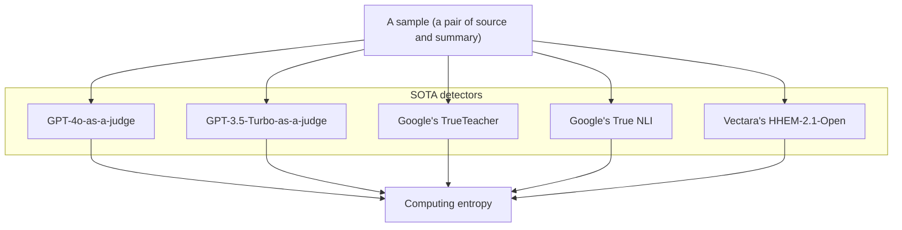

# FaithBench: a human-annotated benchmark on challenging summarization hallucinations of modern LLMs

This repo releases the final data for the NAACL 2025 paper: [FaithBench: A Diverse Hallucination Benchmark for Summarization by Modern LLMs](https://aclanthology.org/2025.naacl-short.38/). A more detailed repo is [here](https://github.com/forrestbao/faithbench).

## Data format

Human-annotated samples are released under [`./data_for_release/`](./data_for_release/), of the name `batch_{batch_id}.json`, where `{batch_id}` ranges from 1 to 16, except 13. To see how to load the data, see [`./scripts/how_to_load.py`](./scripts/how_to_load.py).

The data schema is defined in [`./scripts/faithbench_schema.py`](./scripts/faithbench_schema.py). In short, a sample contains:
* `sample_id`: the id of the sample **in this batch**
* `source`: the source text
* `summary`: the summary text
* `annotations`: a list of annotations -- can be empty if no hallucinations are found. A summary may contain multiple annotations. Different annotators may find different spans of the summary to be non-consistent. The annotation of each non-consistent span includes the label, the note, and the span text on the summary, etc. 
* `metadata`: metadata about the sample, including the summarizer LLM, the prediction of SOTA detectors, and the raw sample id.

The JSON file of each batch is a dump of the `FaithBenchBatch` object (defined in [`./scripts/faithbench_schema.py`](./scripts/faithbench_schema.py)).

```json
{
  "samples": [
    {
      "sample_id": 0,
      "source": "Poseidon (film) . Poseidon grossed $ 181,674,817 at the worldwide box office on a budget of $ 160 million .",
      "summary": " The film \"Poseidon\" grossed $181,674,817 at the worldwide box office, with a production budget of $160 million.",
      "annotations": [
        {
          "annot_id": 1,
          "annotator": "a3ac21668e6249b7978617da547f2708",
          "annotator_name": "Alan Turing",
          "label": [
            "Unwanted",
            "Unwanted.Instrinsic"
          ],
          "note": "\"budget\" (source) vs. \"production budget\" (summary)\nThe budget for a movie may also include non-production budget such as distribution, advertising. ",
          "summary_span": "production",
          "summary_start": 78,
          "summary_end": 88
        },
        {
          "annot_id": 60,
          "annotator": "69a785fa7f454e7da5eef3c608b2133a",
          "annotator_name": "Claude Shannon",
          "label": [
            "Unwanted",
            "Unwanted.Instrinsic"
          ],
          "note": "\"budget\" (source) vs. \"production budget\" (summary) The budget for a movie may also include non-production budget such as distribution, advertising. ",
          "summary_span": "production",
          "summary_start": 78,
          "summary_end": 88
        }
      ],
      "metadata": {
        "summarizer": "mistralai/Mistral-7B-Instruct-v0.3",
        "hhemv1": 0.9995,
        "hhem-2.1": 0.52694,
        "hhem-2.1-english": 0.98313,
        "trueteacher": 1,
        "true_nli": 1,
        "gpt-3.5-turbo": 1,
        "gpt-4-turbo": 1,
        "gpt_4o": 1,
        "raw_sample_id": 15
      },
    },
    // More samples in this batch
  ]
}
```

## Sample inclusion

Today's hallucination detectors, including those using LLMs as judges (LLM-as-a-judge), are very effective at detecting trivial hallucinations. 
FaithBench does not include trivial hallucinations because they won't help improve the detectors.

But finding hard or challenging samples that are worth annotating is a chicken-and-egg problem: 

1. Let's find and annotate samples that are hard for SOTA hallucination detectors.
2. How do we know which samples are hard? We have to annotate them first.

FaithBench takes a proxy route: we hypothesize that a hard sample will have split judgments from SOTA hallucination detectors. Thus, we send a sample to multiple SOTA hallucination detectors, and select the samples that have the highest entropy of judgments.



## Taxonomy of hallucinations

In FaithBench, not all halluciations are bad. Some are benign. Our taxonomy is:
* Consistent -- no annotations needed
* Questionable
* Hallucinated
  * Unwanted 
    * Intrinsic
    * Extrinsic
  * Benign


## Citation

```bibtex
@inproceedings{faithbench-2025-naacl,
    title = "{F}aith{B}ench: A Diverse Hallucination Benchmark for Summarization by Modern {LLM}s",
    author = "Bao, Forrest Sheng  and
      Li, Miaoran  and
      Qu, Renyi  and
      Luo, Ge  and
      Wan, Erana  and
      Tang, Yujia  and
      Fan, Weisi  and
      Tamber, Manveer Singh  and
      Kazi, Suleman  and
      Sourabh, Vivek  and
      Qi, Mike  and
      Tu, Ruixuan  and
      Xu, Chenyu  and
      Gonzales, Matthew  and
      Mendelevitch, Ofer  and
      Ahmad, Amin",
    booktitle = "Proceedings of the 2025 Conference of the Nations of the Americas Chapter of the Association for Computational Linguistics: Human Language Technologies (Volume 2: Short Papers)",
    month = apr,
    year = "2025",
    address = "Albuquerque, New Mexico",
    publisher = "Association for Computational Linguistics",
    url = "https://aclanthology.org/2025.naacl-short.38/",
    pages = "448--461",
    ISBN = "979-8-89176-190-2"
}
